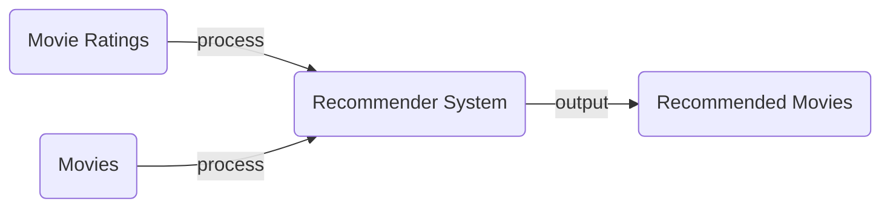
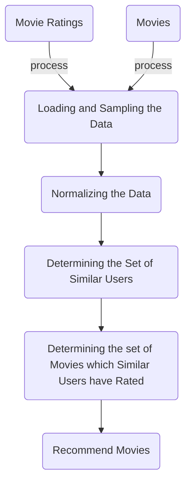

# Movie Recommendations

## Introduction
The implementation of a movie recommendation system on top of the Hadoop platform using Apache Pig. 

## Context
The long tail phenomenon: the distinction between the physical and on-line worlds.This phenomenon forces institutions to recommend items to individual users. It is not reasonable to expect our users to have heard of each item they might like.

## Architecture 
- Input: movie ratings + movies
- Output: recommended movies

## Recommendation System Stages

## Technologies
* Hadoop
* Apache Pig
* Python

