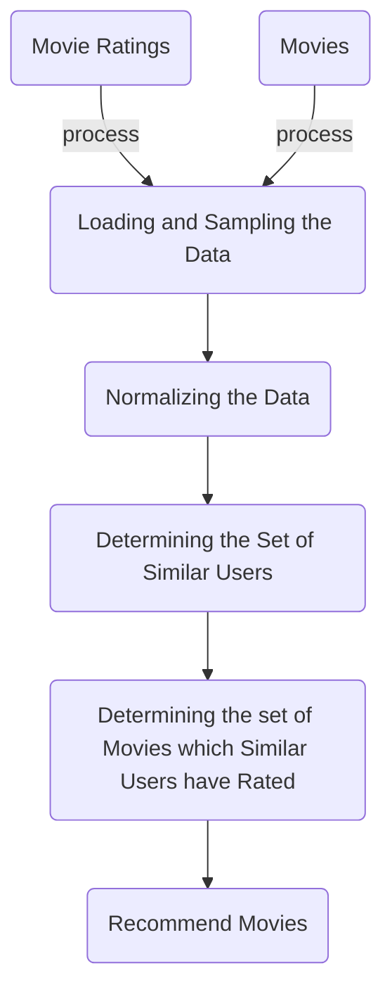

# Movie Recommendations

## Introduction
The implementation of a movie recommendation system on top of the Hadoop platform using Apache Pig and Apache Hive. 

* Project requirements: Recommendations on Movies data.
* Movies dataset: http://grouplens.org/datasets/movielens/20m/.

### Presentation
* [Slides are available here](https://docs.google.com/presentation/d/1flJE76cDtkiJUl0-LrqE31BscOY6Ukis4GiySqb4Z-A/edit)
* [Detailed presentation available here](https://docs.google.com/document/d/17Jc-x1QEjIf455P8WtmnNGKnGs9ZFdbQbJJTbycSHU0/edit)

## Context
The long tail phenomenon: the distinction between the physical and on-line worlds.This phenomenon forces institutions to recommend items to individual users. It is not reasonable to expect our users to have heard of each item they might like.

## Technologies
* Hadoop
* Apache Pig
* Apache Hive
* Python

## Architecture 
- Input: movie ratings + movies
- Output: recommended movies


## Recommendation System Stages



## Code
Project implementation files:
* `recommend.pig`: Contains the main logic of the recommendations application. It uses the Pig scripting language.
* `cosineDistance.py`: Contains the code that computes the Cosine Distance between two users. It is a Python UDF which is used from the recommend.pig script.


## Running the Solution

```sh
Working directory: movie-recommendations

sed '1d' ml-20m/ratings.csv > ml-20m/cleaned-headers-ratings.csv

cut -d',' -f1-3 ml-20m/cleaned-headers-ratings.csv > ml-20m/cleaned-headers-and-columns-ratings.csv

# Store the file on local disk for faster processing.
mv ml-20m/cleaned-headers-and-columns-ratings.csv ml-20m/cleaned-ratings.csv

mkdir ratings
head -100000 ml-20m/cleaned-ratings.csv | sort -R | head -n 100 > ratings/ratings.csv


# Store the file in HDF as well.
hadoop fs -mkdir /movie-recommendations

hadoop fs -put ml-20m/cleaned-ratings.csv /movie-recommendations/ratings/ratings.csv

 pig -c myscript.pig
userRatings: {group: int,normalizedRatings: {(ratings::userId: int,ratings::movieId: int,rating: double)}}

crossedUserRatings: {userRatings::group: int,userRatings::normalizedRatings: {(ratings::userId: int,ratings::movieId: int,rating: double)},userRatingsCopy::group: int,userRatingsCopy::normalizedRatings: {(ratings::userId: int,ratings::movieId: int,rating: double)}}

2016-04-20 04:26:30,032 ERROR org.apache.pig.tools.pigstats.PigStatsUtil: 1 map reduce job(s) failed!
2016-04-20 04:26:30,956 ERROR org.apache.pig.tools.grunt.Grunt: ERROR 1066: Unable to open iterator for alias userCosineDistances
Details at logfile: /home/training/movie-recommendations/pig_1461140635901.log

less /home/training/movie-recommendations/pig_1461142676071.log
less /home/training/movie-recommendations/pig_1461144400386.log

someCrossed =  LIMIT crossedUserRatings 10;
userCosineDistances = 
        FOREACH someCrossed
        GENERATE userRatings::group AS userId1, 
                 userRatingsCopy::group AS userId2,
                         helpers.cosineDistance(
                                                userRatings::normalizedRatings, 
                                                userRatingsCopy::normalizedRatings
                                                ) AS cosineDist;


groupedDistances = GROUP userCosineDistances BY userId1;
DESCRIBE groupedDistances;

groupedDistances: {group: int,userCosineDistances: {(userId1: int,userId2: int,cosineDist: float)}}

         

t = (1,2,3)
dict((movieId, rating) for (userId, movieId, rating) in enumerate([a,a]))
pig -x local -p SAMPLE_SIZE=0.1 -p USER_ID=584 -p RECOMMENDATIONS_NUMBER=5 recommend.pig 

 
pig -p SAMPLE_SIZE=0.00001 -p USER_ID=584 -p RECOMMENDATIONS_NUMBER=5 -p CLOSEST_USERS_NUMBER=5 recommend.pig 

pig -p USER_ID=584 -dryrun recommend.pig 
pig -p USER_ID=584 -dryrun recommend.pig && pig -c recommend.pig.substituted
pig -p USER_ID=584 -p SAMPLE_SIZE=0.00001 -x local recommend.pig 

userId = 584
(Toy Story (1995))
(Taxi Driver (1976))
(Shawshank Redemption)
(Lion King)
(Better Off Dead... (1985))
```
## Dataset
***, GroupLens, MovieLens 20M Dataset. [http://grouplens.org/datasets/movielens/20m/](http://grouplens.org/datasets/movielens/20m/);


